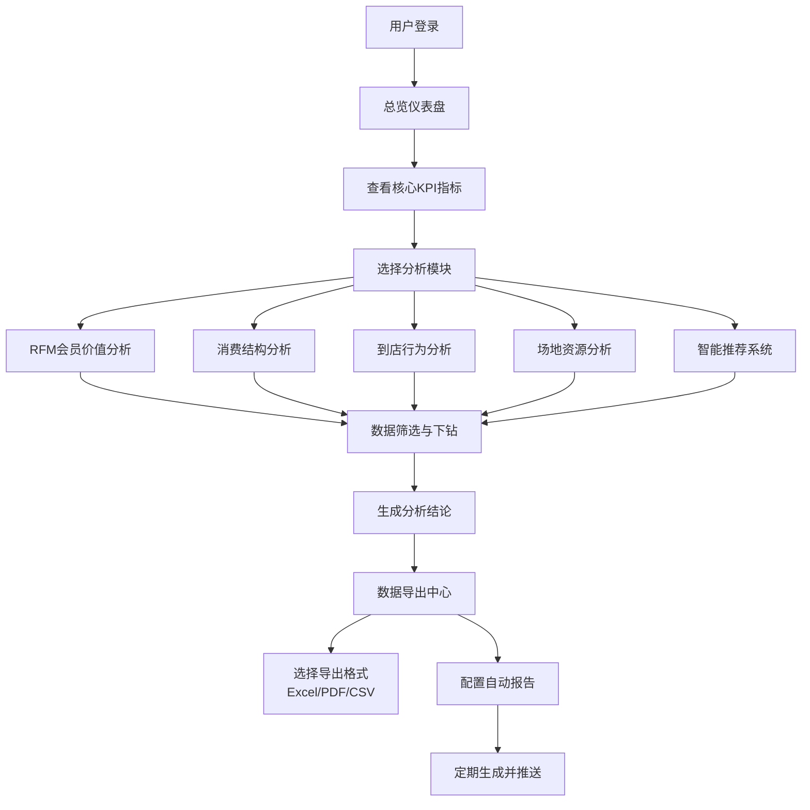

## 1. 产品概述

本产品是面向高端会所的会员消费行为智能分析看板，通过深度挖掘会员消费数据，提供全方位的会员价值评估、消费习惯洞察、运营决策支持。系统整合RFM价值分析、消费结构解析、到店行为追踪、场地资源优化及智能推荐五大核心模块，助力会所实现精准营销、精细化运营和客户关系管理。

### 1.1 产品目标
- 将会员数据转化为可执行的商业洞察
- 识别高价值会员并预防流失
- 优化场地资源配置和人员排班
- 提升会员复购率和客单价
- 支持数据驱动的运营决策

### 1.2 目标用户
- 会所管理层（总经理、运营总监）
- 会员经理/客户关系专员
- 营销策划人员
- 场地运营主管

---

## 2. 核心功能

### 2.1 用户角色

| 角色 | 登录方式 | 核心权限 |
|------|----------|----------|
| 管理员 | 账号密码登录 | 全部功能访问、数据导出、报告配置、用户管理 |
| 运营人员 | 账号密码登录 | 数据分析、查看报告、基础筛选功能 |
| 会员经理 | 账号密码登录 | 会员分析、流失预警、推荐系统使用 |

### 2.2 功能模块

1. **RFM会员价值分析**：会员价值评估、群体分类、流失风险预警、热力图与占比分析
2. **消费结构分析**：类目占比、趋势分析、交叉维度分析、行业基准对比
3. **到店行为分析**：频次统计、等级对比、时间分布、相关性分析
4. **场地资源分析**：使用率对比、热力图、排班建议、满意度关联
5. **智能推荐系统**：协同过滤推荐、新酒款推荐、活动推荐、效果追踪
6. **数据导出中心**：多格式导出、自动报告生成、报告调度

### 2.3 页面详情

| 页面名称 | 模块名称 | 功能描述 |
|-----------|-------------|---------------------|
| 总览仪表盘 | 核心指标卡片 | 展示会员总数、本月消费额、到店人次、高价值会员数等KPI，支持实时刷新 |
| 总览仪表盘 | 快捷入口 | 一键跳转至各分析模块，快速访问常用功能 |
| RFM分析页 | RFM评分面板 | 三维度评分展示、会员分布热力图、各维度直方图 |
| RFM分析页 | 会员群体分类 | 八类会员群体占比饼图、各群体特征标签、会员明细列表 |
| RFM分析页 | 流失风险预警 | 高价值流失会员列表、风险等级色标、优先级排序、维护建议 |
| 消费结构分析页 | 类目占比分析 | 多层级环形图展示餐饮/酒水/SPA/棋牌/客房消费占比 |
| 消费结构分析页 | 趋势折线图 | 月度/季度人均消费趋势、多系列对比、支持切换时间粒度 |
| 消费结构分析页 | 交叉分析 | 按等级/性别/年龄段筛选、多维数据透视表、下钻分析 |
| 消费结构分析页 | 行业基准对比 | 雷达图对比各类目与行业均值、差距分析与提升建议 |
| 到店行为分析页 | 频次分布图 | 会员月到店次数直方图、箱线图展示离散程度 |
| 到店行为分析页 | 等级对比分析 | 不同等级会员到店规律柱状图、趋势对比 |
| 到店行为分析页 | 时间分布特征 | 工作日/周末分布饼图、24小时热力图、高峰时段标注 |
| 到店行为分析页 | 相关性分析 | 散点图展示到店频次与消费金额关系、回归分析与相关系数 |
| 场地资源分析页 | 使用率对比 | 分组柱状图对比工作日晚间与周末各场地使用率 |
| 场地资源分析页 | 时段热力图 | 7×24小时热力矩阵、场地维度切换、颜色渐变标识繁忙程度 |
| 场地资源分析页 | 排班建议 | 基于预测的人员需求表、班次优化方案、人力成本估算 |
| 场地资源分析页 | 满意度关联 | 双轴图展示使用率与满意度关系、 correlation 分析 |
| 智能推荐页 | 新酒款推荐 | 推荐酒款卡片、推荐理由说明、相似会员反馈、推荐评分 |
| 智能推荐页 | 活动推荐 | 个性化活动列表、匹配度百分比、会员偏好标签 |
| 智能推荐页 | 效果追踪 | 点击率/转化率趋势图、A/B测试对比、推荐ROI分析 |
| 数据导出页 | 导出配置 | 选择数据集、时间范围、导出格式（Excel/PDF/CSV） |
| 数据导出页 | 自动报告 | 报告模板配置、调度周期设置、邮件推送配置 |
| 数据导出页 | 导出历史 | 历史导出记录、下载状态、重新生成 |

---

## 3. 核心流程

### 3.1 主流程描述
用户登录系统后，首先进入总览仪表盘查看核心经营指标。根据分析需求，可选择进入相应的分析模块：通过RFM分析识别高价值会员及流失风险，通过消费结构分析了解各类目贡献，通过到店行为分析掌握会员消费规律，通过场地资源分析优化运营效率，通过智能推荐提升会员转化率。所有分析结果均可通过数据导出中心生成报告，支持定期自动推送。

### 3.2 核心流程图

---

## 4. 用户界面设计

### 4.1 设计风格
- **设计基调**：奢华精致，契合高端会所定位
- **主色调**：深邃藏青 `#1a1f2e` 作为背景主色，搭配香槟金 `#d4af37` 作为强调色
- **辅助色**：深酒红 `#722f37`、墨绿 `#1f4d3c`、皇家紫 `#2e1a47` 形成丰富的视觉层次
- **中性色**：象牙白 `#f5f0e8`、暖灰 `#8b8680` 用于文字和边框
- **按钮风格**：微渐变圆角按钮，悬浮时金色光晕效果，点击时轻微下沉
- **字体**：标题使用 "Playfair Display" 衬线字体彰显尊贵，正文使用 "Inter" 无衬线字体确保可读性
- **布局风格**：卡片式布局，细微金色边框，柔和平行光阴影，营造高端质感
- **图标风格**：线性图标，金色填充，统一16px/24px/32px三种规格
- **背景效果**：深色底搭配细微网格纹理，关键区域添加渐变光晕，营造沉浸感

### 4.2 页面设计概览

| 页面名称 | 模块名称 | UI元素设计 |
|-----------|-------------|-------------|
| 总览仪表盘 | 核心指标卡片 | 金色渐变边框，数值动态增长动画，图标微动画，悬浮时轻微上浮并加深阴影 |
| 总览仪表盘 | 快捷入口 | 六边形磁贴设计，图标居中，悬浮时旋转缩放效果，背景色从藏青渐变至金色 |
| RFM分析页 | 会员群体分类 | 八色圆环图，中心显示总会员数，图例对应会员标签，点击切片高亮并筛选列表 |
| RFM分析页 | 流失风险预警 | 表格行按风险等级染色（深红/橙/黄），支持点击展开会员详情，操作按钮固定右侧 |
| 消费结构分析页 | 类目占比环形图 | 多层级环形设计，内层显示大类，外层显示子类，鼠标悬停显示明细数据 |
| 消费结构分析页 | 趋势折线图 | 平滑贝塞尔曲线，各系列对应主题色，数据点带光晕效果，支持点击跳转数据明细 |
| 到店行为分析页 | 24小时热力图 | 竖向时间轴，横向星期轴，颜色从浅金到深红渐变，鼠标悬停显示具体数值 |
| 场地资源分析页 | 时段热力图 | 矩阵式布局，支持场地切换Tab，单元格点击弹出时段详情，颜色带透明度变化 |
| 智能推荐页 | 推荐酒款卡片 | 左侧酒款图片，右侧名称/价格/推荐理由/匹配度，悬浮时金色描边高亮，底部操作按钮 |
| 数据导出页 | 导出配置面板 | 分步表单设计，步骤指示器，表单控件带金色焦点边框，提交按钮脉冲动画 |

### 4.3 响应式设计
- **设计原则**：Desktop-first，渐进式适配移动端
- **断点设计**：≥1280px（桌面端）、768px-1279px（平板端）、<768px（手机端）
- **布局适配**：桌面端4列网格→平板端2列→手机端单列堆叠
- **图表适配**：大屏展示完整图表，小屏自动切换为简化版或列表视图，支持横屏查看
- **交互优化**：移动端增加底部导航Tab，图表支持触摸滑动和双指缩放，按钮最小点击区域48×48px
- **性能优化**：移动端懒加载非首屏图表，减少动画复杂度

### 4.4 动效设计
- **页面入场**：主体内容从下向上渐入，卡片依次延迟显示，形成瀑布流入场效果
- **数据更新**：数值变化时数字滚动动画，图表数据平滑过渡，新数据高亮闪烁提示
- **交互反馈**：按钮点击涟漪效果，Tab切换滑动过渡，下拉展开/收起平滑动画
- **加载状态**：骨架屏占位，内容加载完成后骨架淡出内容淡入，关键指标使用脉冲动画
- **滚动动效**：滚动时导航栏毛玻璃效果，侧边栏随滚动进度高亮当前菜单项
