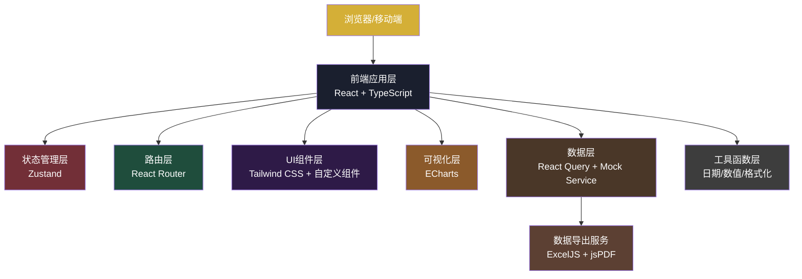
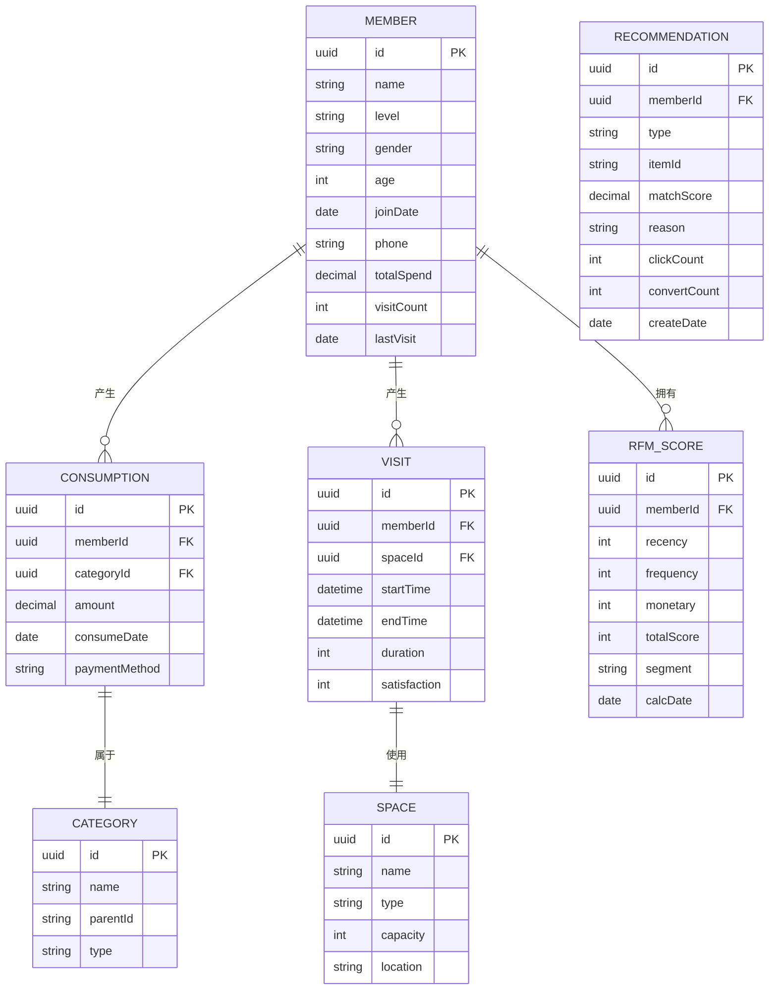

## 1. 架构设计



---

## 2. 技术选型说明

### 2.1 核心技术栈
- **前端框架**：React 18 + TypeScript 5，确保类型安全和开发效率
- **构建工具**：Vite 5，提供极速开发体验和生产构建
- **样式方案**：Tailwind CSS 3，原子化CSS实现快速开发
- **状态管理**：Zustand，轻量高效的状态管理方案
- **路由管理**：React Router 6，单页应用路由解决方案
- **数据可视化**：ECharts 5，功能强大的图表库，支持复杂图表需求
- **数据请求**：TanStack Query（React Query），服务端状态管理
- **图标库**：Lucide React，优雅的线性图标库
- **数据导出**：ExcelJS（Excel导出）、jsPDF（PDF导出）、PapaParse（CSV导出）
- **动画库**：Framer Motion，实现流畅的交互动画

### 2.2 项目初始化
- 初始化工具：`vite-init`
- 模板：`react-express-ts`（React + TypeScript + Express，可选后端支持）
- 包管理器：优先使用pnpm，备选npm

### 2.3 后端服务（可选）
- 框架：Express 4 + TypeScript
- 用途：提供模拟API接口、数据导出服务、自动报告调度
- 数据库：SQLite（轻量级嵌入式数据库，存储配置和报告历史）

---

## 3. 目录结构

```
project-root/
├── src/                           # 前端源码
│   ├── assets/                    # 静态资源
│   │   ├── fonts/                 # 字体文件
│   │   └── images/                # 图片资源
│   ├── components/                # 可复用组件
│   │   ├── charts/                # 图表组件
│   │   │   ├── RFMHeatmap.tsx     # RFM热力图
│   │   │   ├── PieChart.tsx       # 饼图组件
│   │   │   ├── LineChart.tsx      # 折线图组件
│   │   │   ├── BarChart.tsx       # 柱状图组件
│   │   │   ├── Heatmap.tsx        # 通用热力图
│   │   │   ├── RadarChart.tsx     # 雷达图组件
│   │   │   └── ScatterChart.tsx   # 散点图组件
│   │   ├── layout/                # 布局组件
│   │   │   ├── Header.tsx         # 顶部导航
│   │   │   ├── Sidebar.tsx        # 侧边栏
│   │   │   ├── Layout.tsx         # 主布局
│   │   │   └── MobileNav.tsx      # 移动端导航
│   │   ├── ui/                    # 基础UI组件
│   │   │   ├── Card.tsx           # 卡片组件
│   │   │   ├── Button.tsx         # 按钮组件
│   │   │   ├── Table.tsx          # 表格组件
│   │   │   ├── Tabs.tsx           # 标签页组件
│   │   │   ├── Select.tsx         # 下拉选择
│   │   │   ├── DatePicker.tsx     # 日期选择
│   │   │   ├── Modal.tsx          # 模态框
│   │   │   ├── Skeleton.tsx       # 骨架屏
│   │   │   └── MetricCard.tsx     # 指标卡片
│   │   └── export/                # 导出相关组件
│   │       └── ExportPanel.tsx    # 导出配置面板
│   ├── pages/                     # 页面组件
│   │   ├── Dashboard.tsx          # 总览仪表盘
│   │   ├── RFMAnalysis.tsx        # RFM分析页
│   │   ├── Consumption.tsx        # 消费结构分析页
│   │   ├── VisitBehavior.tsx      # 到店行为分析页
│   │   ├── SpaceUtilization.tsx   # 场地资源分析页
│   │   ├── Recommendation.tsx     # 智能推荐页
│   │   └── DataExport.tsx         # 数据导出页
│   ├── hooks/                     # 自定义Hooks
│   │   ├── useDashboardData.ts    # 仪表盘数据Hook
│   │   ├── useRFMData.ts          # RFM数据Hook
│   │   ├── useExport.ts           # 导出功能Hook
│   │   ├── useRealTimeUpdate.ts   # 实时更新Hook
│   │   └── useResponsive.ts       # 响应式Hook
│   ├── store/                     # 状态管理
│   │   ├── useFilterStore.ts      # 筛选条件Store
│   │   └── useUserStore.ts        # 用户信息Store
│   ├── services/                  # API服务
│   │   ├── api.ts                 # API实例配置
│   │   ├── mock/                  # Mock数据服务
│   │   │   ├── members.ts         # 会员Mock数据
│   │   │   ├── consumption.ts     # 消费Mock数据
│   │   │   └── space.ts           # 场地Mock数据
│   │   ├── memberService.ts       # 会员数据服务
│   │   ├── consumptionService.ts  # 消费数据服务
│   │   ├── spaceService.ts        # 场地数据服务
│   │   ├── recommendService.ts    # 推荐服务
│   │   └── exportService.ts       # 导出服务
│   ├── utils/                     # 工具函数
│   │   ├── format.ts              # 格式化工具
│   │   ├── date.ts                # 日期工具
│   │   ├── math.ts                # 数学计算
│   │   ├── rfm.ts                 # RFM计算工具
│   │   └── export/                # 导出工具
│   │       ├── excel.ts           # Excel导出
│   │       ├── pdf.ts             # PDF导出
│   │       └── csv.ts             # CSV导出
│   ├── types/                     # TypeScript类型定义
│   │   ├── member.ts              # 会员相关类型
│   │   ├── consumption.ts         # 消费相关类型
│   │   ├── space.ts               # 场地相关类型
│   │   ├── recommend.ts           # 推荐相关类型
│   │   └── common.ts              # 通用类型
│   ├── App.tsx                    # 根组件
│   ├── main.tsx                   # 入口文件
│   └── index.css                  # 全局样式
├── api/                           # 后端API（可选）
│   ├── src/
│   │   ├── controllers/           # 控制器
│   │   ├── services/              # 业务逻辑
│   │   ├── routes/                # 路由定义
│   │   └── index.ts               # 服务入口
│   └── package.json
├── shared/                        # 前后端共享类型
│   └── types.ts
├── migrations/                    # 数据库迁移（可选）
├── public/                        # 公共静态资源
├── vite.config.ts                 # Vite配置
├── tailwind.config.js             # Tailwind配置
├── tsconfig.json                  # TypeScript配置
├── package.json                   # 项目依赖
└── .env                           # 环境变量
```

---

## 4. 路由定义

| 路由路径 | 页面名称 | 说明 |
|----------|----------|------|
| `/` | 总览仪表盘 | 首页，展示核心KPI和快捷入口 |
| `/rfm` | RFM会员价值分析 | RFM模型分析、会员分类、流失预警 |
| `/consumption` | 消费结构分析 | 类目占比、趋势、交叉分析、行业对比 |
| `/visit` | 到店行为分析 | 频次统计、等级对比、时间分布、相关性 |
| `/space` | 场地资源分析 | 使用率、热力图、排班建议、满意度关联 |
| `/recommend` | 智能推荐系统 | 酒款推荐、活动推荐、效果追踪 |
| `/export` | 数据导出中心 | 数据导出、自动报告配置、导出历史 |

---

## 5. 核心数据模型

### 5.1 实体关系图



### 5.2 核心数据定义

```typescript
// 会员信息
interface Member {
  id: string;
  name: string;
  level: '普通' | '银卡' | '金卡' | '钻石';
  gender: '男' | '女';
  age: number;
  ageGroup: '18-25' | '26-35' | '36-45' | '46-55' | '55+';
  joinDate: string;
  totalSpend: number;
  visitCount: number;
  lastVisit: string;
  avatar?: string;
}

// RFM评分
interface RFMScore {
  memberId: string;
  recency: number;      // 1-5分
  frequency: number;    // 1-5分
  monetary: number;     // 1-5分
  totalScore: number;   // 3-15分
  segment: string;      // 会员群体标签
  lastConsumeDays: number;
  consumeFrequency: number;
  consumeAmount: number;
}

// 消费记录
interface ConsumptionRecord {
  id: string;
  memberId: string;
  category: string;
  subCategory: string;
  amount: number;
  date: string;
  time: string;
  weekday: number;
}

// 场地使用记录
interface SpaceUsage {
  spaceId: string;
  spaceName: string;
  spaceType: string;
  date: string;
  hour: number;
  weekday: number;
  usageRate: number;
  satisfaction: number;
}

// 推荐结果
interface Recommendation {
  id: string;
  memberId: string;
  type: 'wine' | 'activity';
  itemName: string;
  itemImage: string;
  price?: number;
  matchScore: number;
  reason: string;
  similarFeedback: string[];
  clickCount: number;
  convertCount: number;
}

// 筛选条件
interface FilterOptions {
  dateRange: [string, string];
  memberLevels: string[];
  genders: string[];
  ageGroups: string[];
  categories: string[];
}
```

---

## 6. 状态管理设计

### 6.1 筛选条件Store

```typescript
interface FilterState {
  dateRange: [string, string];
  memberLevels: string[];
  genders: string[];
  ageGroups: string[];
  categories: string[];
  setDateRange: (range: [string, string]) => void;
  setMemberLevels: (levels: string[]) => void;
  setGenders: (genders: string[]) => void;
  setAgeGroups: (groups: string[]) => void;
  setCategories: (categories: string[]) => void;
  resetFilters: () => void;
}
```

### 6.2 用户Store

```typescript
interface UserState {
  user: User | null;
  isLoggedIn: boolean;
  permissions: string[];
  login: (username: string, password: string) => Promise<boolean>;
  logout: () => void;
  hasPermission: (permission: string) => boolean;
}
```

---

## 7. 图表配置规范

### 7.1 主题色板

```typescript
const chartTheme = {
  // 主色调
  primary: '#d4af37',      // 香槟金
  secondary: '#1a1f2e',    // 深邃藏青
  // 辅助色
  accent1: '#722f37',      // 深酒红
  accent2: '#1f4d3c',      // 墨绿
  accent3: '#2e1a47',      // 皇家紫
  accent4: '#8b5a2b',      // 古铜色
  accent5: '#4a3728',      // 深棕
  // 渐变色
  gradientGold: ['#f5e6a8', '#d4af37', '#8b6914'],
  gradientHeat: ['#f5e6a8', '#f4c542', '#e67e22', '#c0392b', '#722f37'],
  // 中性色
  textPrimary: '#f5f0e8',
  textSecondary: '#8b8680',
  background: '#1a1f2e',
  backgroundLight: '#252b3d',
  border: 'rgba(212, 175, 55, 0.2)',
};
```

### 7.2 通用图表配置

```typescript
const commonChartOption = {
  backgroundColor: 'transparent',
  color: [
    chartTheme.primary,
    chartTheme.accent1,
    chartTheme.accent2,
    chartTheme.accent3,
    chartTheme.accent4,
  ],
  textStyle: {
    fontFamily: 'Inter, sans-serif',
    color: chartTheme.textSecondary,
  },
  title: {
    textStyle: {
      fontFamily: 'Playfair Display, serif',
      color: chartTheme.textPrimary,
      fontSize: 18,
    },
  },
  tooltip: {
    backgroundColor: chartTheme.backgroundLight,
    borderColor: chartTheme.primary,
    textStyle: {
      color: chartTheme.textPrimary,
    },
  },
  grid: {
    left: '3%',
    right: '4%',
    bottom: '3%',
    containLabel: true,
  },
};
```

---

## 8. API接口定义（可选后端）

### 8.1 会员数据接口

```typescript
// 获取会员列表
GET /api/members
Query: { page: number, pageSize: number, filters: FilterOptions }
Response: { data: Member[], total: number }

// 获取会员RFM评分
GET /api/members/rfm
Query: { filters: FilterOptions }
Response: { data: RFMScore[], summary: RFMSummary }

// 获取会员消费记录
GET /api/members/:id/consumption
Query: { dateRange: [string, string] }
Response: { data: ConsumptionRecord[] }
```

### 8.2 消费数据接口

```typescript
// 获取消费结构数据
GET /api/consumption/structure
Query: { filters: FilterOptions }
Response: {
  categoryBreakdown: { name: string, value: number }[],
  trendData: { date: string, categories: Record<string, number> }[],
}

// 获取行业基准数据
GET /api/consumption/benchmark
Response: {
  categories: string[],
  industryAvg: number[],
  clubData: number[],
}
```

### 8.3 场地数据接口

```typescript
// 获取场地使用率
GET /api/space/usage
Query: { spaceId?: string, dateRange: [string, string] }
Response: {
  heatmapData: { weekday: number, hour: number, value: number }[],
  comparison: { space: string, weekdayEvening: number, weekend: number }[],
}
```

### 8.4 推荐接口

```typescript
// 获取会员推荐
GET /api/recommend/:memberId
Query: { type: 'wine' | 'activity' }
Response: { data: Recommendation[] }

// 记录推荐效果
POST /api/recommend/track
Body: { recommendId: string, action: 'click' | 'convert' }
Response: { success: boolean }
```

### 8.5 导出接口

```typescript
// 导出数据
POST /api/export
Body: {
  dataset: string,
  format: 'excel' | 'pdf' | 'csv',
  filters: FilterOptions,
  templateId?: string,
}
Response: { downloadUrl: string, filename: string }

// 获取导出历史
GET /api/export/history
Response: { data: ExportRecord[] }

// 配置自动报告
POST /api/export/schedule
Body: {
  templateId: string,
  cron: string,
  format: string[],
  recipients: string[],
}
Response: { scheduleId: string }
```

---

## 9. 性能优化策略

### 9.1 前端性能优化
- **代码分割**：按路由进行代码分割，首屏只加载必要资源
- **图表懒加载**：非首屏图表使用Intersection Observer延迟加载
- **虚拟滚动**：大数据量表格使用虚拟滚动
- **数据缓存**：React Query配置合理的缓存时间和重试策略
- **资源预加载**：关键字体和资源使用preload
- **防抖节流**：搜索、筛选等高频操作添加防抖节流

### 9.2 数据优化
- **Mock数据生成**：使用faker.js生成高质量模拟数据，预置1000+会员样本
- **数据聚合**：提前计算RFM评分、趋势数据等聚合指标
- **分页加载**：列表数据支持分页和无限滚动
- **Web Worker**：复杂计算（如协同过滤算法）在Web Worker中执行

### 9.3 构建优化
- **Tree Shaking**：确保ECharts等库按需引入
- **图片优化**：使用WebP格式，关键图标使用SVG
- **压缩优化**：开启gzip/brotli压缩
- **CDN加速**：静态资源配置CDN

---

## 10. 安全考虑

### 10.1 前端安全
- XSS防护：React默认防XSS，危险HTML使用DOMPurify过滤
- 敏感信息：不在localStorage存储敏感数据
- 路由守卫：未登录用户跳转登录页，权限不足提示

### 10.2 数据安全
- 演示数据：所有展示数据均为Mock数据，不包含真实会员信息
- 数据脱敏：如需真实数据，手机号、姓名等信息需脱敏展示
- 导出水印：导出的PDF报告添加系统水印

---

## 11. 开发规范

### 11.1 命名规范
- 组件：PascalCase（如 `RFMHeatmap.tsx`）
- Hooks：camelCase，use开头（如 `useRFMData.ts`）
- 工具函数：camelCase（如 `formatCurrency.ts`）
- 常量：UPPER_SNAKE_CASE（如 `MEMBER_LEVELS`）
- 类型：PascalCase，I开头可选（如 `IMember` 或 `Member`）

### 11.2 代码规范
- 组件函数使用箭头函数
- 使用TypeScript严格模式
- 避免any类型，使用泛型和类型守卫
- 组件代码控制在300行以内，复杂组件拆分
- 使用ESLint + Prettier统一代码风格

### 11.3 Git规范
- feat: 新功能
- fix: 修复bug
- docs: 文档更新
- style: 代码格式调整
- refactor: 重构
- perf: 性能优化
- test: 测试相关
